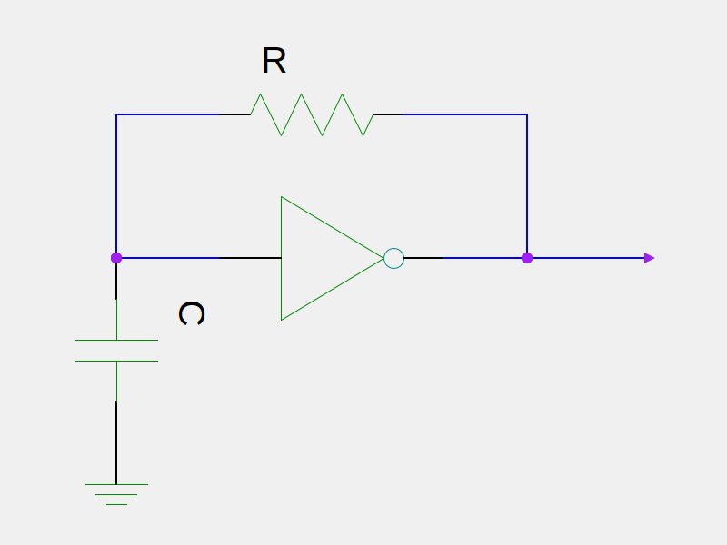
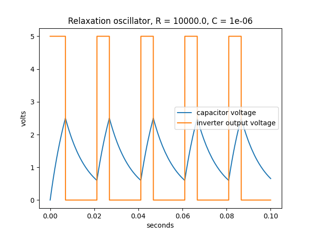

# relaxation
Simulation of a relaxation oscillator based on a digital inverter.

The oscillator uses an inverter to charge and discharge a capacitor.  When the
voltage across the capacitor reaches the threshold for changing the inverter
state, the inverter flips its state and starts discharging the capacitor if it was previously charging it, or starts charging the capacitor if it was discharging it.  The period depends upon to the time constant of the RC circuit, but is modified because of the state change thresholds in the inverter. This is a simple numeric simulation to determine the frequency given specified values for the components.



Build it using:

`g++ -std=c++17 -o relaxation relaxation.cpp`


The output is a file called output.csv that contains the capacitor and inverter
output voltages at each timestep, and description.dat, a file that contains
the input pararameters and the resulting inverter output frequency in the format:

```FILE = output.csv
RESISTANCE = 1000
CAPACITANCE = 1e-07
LH = 5
LL = 0
LLT = 2.5
LHT = 0.6
FREQUENCY = 5018.82
```

LH is the logic high output voltage of the inverter, and LL the logic low voltage.  LLT and LHT are the low-to-high and high-to-low transition voltages for the inverter input logic.

Run it using:

`./relaxation <RESISTANCE> <CAPACITANCE> <LH> <LL> <LLT> <LHT>`

e.g.

`./relaxation 1e4 1e-6 0 5 0.6 2.5`

Any parameters missing take a default value.

plot.py is a Python 3 script that plots the contents of output.csv, generating
the title of the plot from some of the contents of description.dat.  It produces a PDF format plot that looks something like this (depending upon parameters):




n.b. the gSchem symbol for an inverter, in schematic/INV1-1.sym, that
I have used to draw the circuit diagram, is by jpd@noqsi.com, and
licensed under the GNU General Public License.  I have modified it slightly
to remove the prominant "1" from the inverter body. See http://www.gedasymbols.org/user/john_doty/symbols/openIP/INV1-1.sym

## Build environment

The build environment was Ubuntu 20.04.  The `Makefile` targets are:

1. _default_ Rebuild relaxation executable and plot.pdf
1. relaxation Rebuild relaxation executable
1. clean Delete all targets

The dependencies are as follows.  The versions probably don't matter much
but I have included them in case they do.

* g++ (Ubuntu 9.3.0-10ubuntu2) 9.3.0
* python (3.8.2)
* gEDA (1.8.2) - if you want to regenerate schematics/circuit.png which is done manually


